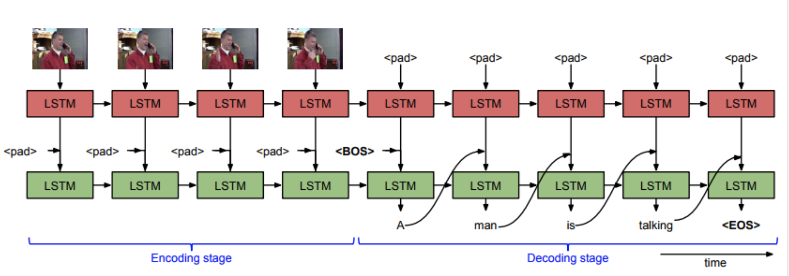

# Video Captioning Model

This is a Sequence to Sequence Artificial Intelligence model that reads in the frames of a video and 
generates a caption of said video. The output for the videos will be in the output.txt file. 

## If program starts training then set num_epochs to 0 on line 40 in model_seq2seq.py
## If you want the program to train then set num_epochs to any desired amount. 

Run the following command to add the dependencies for the project

```
python3 -m pip install -r requirements.txt
```

Run program by using the shell script 
```
sh hw2_seq2seq.sh MSVD output.txt
```

Model Implementation

